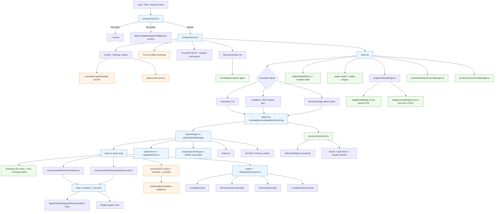

# Claude Code CLI Runtime: Deep Reverse-Engineering Analysis

**Author:** Lakshmikanthan K (letchupkt)  
---

## Executive Overview

This repository contains the core runtime behind **Claude Code**, Anthropic's coding CLI agent.  
It is not just a command wrapper. It is a full execution platform for:

- Interactive coding sessions in terminal UI mode
- Headless SDK/automation workflows
- Remote and bridge-driven sessions
- Multi-agent task orchestration
- MCP-native tool integration
- Enterprise-grade policy, permissions, and managed settings

From an engineering perspective, this system is significant because it combines:

- A high-performance startup path
- Deep runtime modularity through feature gates
- Safety boundaries (trust, permissions, sandbox, policy controls)
- Strong extensibility (tools, skills, plugins, MCP servers)
- Stateful long-running session infrastructure

---

## System Architecture

### High-Level Model

Claude Code is organized into six runtime layers:

1. **CLI Entry Dispatcher**: Fast-path command routing and selective module loading.
2. **Initialization Layer**: Config, trust gates, env setup, network transport setup, telemetry boot.
3. **Session Runtime Layer**: Interactive + non-interactive execution coordination.
4. **Query/Tool Execution Core**: Main agent loop, token/context control, tool orchestration.
5. **Integration Plane**: MCP, plugin/skill systems, remote and bridge transports.
6. **State/Persistence Plane**: App state, transcript JSONL storage, history, cost and usage tracking.

### Complete Architecture (Mermaid)

### Core Entry Points

- `entrypoints/cli.tsx`: boot dispatcher with aggressive fast-path routing and dead-code-eliminated feature branches.
- `entrypoints/init.ts`: one-time memoized runtime initializer.
- `main.tsx`: primary CLI orchestration and mode selection.
- `cli/print.ts`: streaming/control runtime for interactive and SDK-like flows.
- `entrypoints/mcp.ts`: standalone MCP server runtime.

### Data and Control Flow

- User input/SDK events enter `print.ts`.
- `QueryEngine` constructs turn context and invokes `query.ts` generator loop.
- `query.ts` streams assistant tokens, executes tool-use blocks, and handles compaction/recovery transitions.
- Tool calls route through orchestration with concurrency partitioning and context mutation.
- State and transcript writes are continuously synchronized via AppState + JSONL persistence.

---

## Internal Systems & Modules

### 1. Entrypoint and Boot Modules

| Module | Responsibility |
|---|---|
| `entrypoints/cli.tsx` | Fast-path command dispatch, feature-gated startup routes (bridge, daemon, bg, templates, workers). |
| `entrypoints/init.ts` | Config enablement, safe env application, trust-sensitive setup, network/mTLS/proxy setup, telemetry prep. |
| `main.tsx` | Full CLI command-line behavior, mode setup, policy checks, tool/command pool composition. |

### 2. Query Runtime

| Module | Responsibility |
|---|---|
| `query.ts` | Core turn state machine, tool/result pairing, token-budget logic, compact/recovery controls, stop-hooks. |
| `QueryEngine.ts` | Session-scoped wrapper around query loop for headless/SDK style usage and state carry-over. |
| `query/config.ts`, `query/deps.ts` | Dependency injection and runtime config assembly for testability/fallbacks. |

### 3. Tooling System

| Module | Responsibility |
|---|---|
| `tools.ts` | Canonical tool registry and capability filtering by environment/feature gates/permissions. |
| `Tool.ts` | Tool contracts, tool permission context, execution context, schemas and runtime invariants. |
| `services/tools/toolOrchestration.ts` | Serial vs concurrent tool partitioning using tool-level `isConcurrencySafe`. |
| `services/tools/StreamingToolExecutor.ts` | Streaming-time tool scheduling, cancellation, sibling abort behavior, ordered result yielding. |

### 4. Command System

| Module | Responsibility |
|---|---|
| `commands.ts` | Command registry, internal-only command partitioning, dynamic command loading from skills/plugins. |
| `commands/*` | Built-in slash command implementations, including gated/internal operations. |

### 5. Agent and Task Subsystem

| Module | Responsibility |
|---|---|
| `tasks/*` | Multiple task backends (local agent, in-process teammate, remote agent, local main-session). |
| `utils/task/framework.ts` | Shared lifecycle, polling, output offset tracking, SDK/task notification bridging. |
| `coordinator/coordinatorMode.ts` | Coordinator-mode behavioral contract and worker-prompt governance. |

### 6. State Management

| Module | Responsibility |
|---|---|
| `bootstrap/state.ts` | Global runtime singleton state (session, telemetry counters, feature latches, prompt metadata). |
| `state/store.ts` | Minimal immutable store primitive with `onChange` hooks. |
| `state/AppStateStore.ts` | Full UI/runtime app state schema including tasks, MCP, plugins, bridge statuses. |
| `state/onChangeAppState.ts` | Side-effect bridge from state transitions to persisted settings/metadata notifications. |

### 7. Bridge, Remote, and Direct Connect

| Module | Responsibility |
|---|---|
| `bridge/bridgeMain.ts` | Remote-control bridge orchestration (environment/session lifecycle). |
| `bridge/replBridge.ts` | Env-based REPL bridge transport and event forwarding. |
| `bridge/remoteBridgeCore.ts` | Env-less CCRv2 bridge path (session-ingress direct mode). |
| `remote/RemoteSessionManager.ts` | Client-side remote session coordinator with permission request loop handling. |
| `server/directConnectManager.ts` | Direct websocket control channel manager and permission response protocol. |

### 8. MCP Integration Layer

| Module | Responsibility |
|---|---|
| `services/mcp/client.ts` | MCP transport/client manager, auth, tool/resource exposure, retries/session-expiry handling. |
| `entrypoints/mcp.ts` | Exposes local tools via MCP server endpoint. |
| `services/mcp/config.ts` | MCP config parsing, filtering, policy controls, server signature logic. |

### 9. Skills and Plugins

| Module | Responsibility |
|---|---|
| `skills/loadSkillsDir.ts` | Skill discovery and frontmatter parsing from project/user/policy/plugin sources. |
| `skills/bundled/index.ts` | Built-in skill registration with gate-dependent additions. |
| `utils/plugins/pluginLoader.ts` | Plugin fetch/load/validation/cache/versioning and seed-cache probing. |
| `plugins/builtinPlugins.ts` | Toggleable built-in plugin registry. |

### 10. Memory and Persistence

| Module | Responsibility |
|---|---|
| `memdir/*` | Persistent memory prompt shaping, index truncation, and memory file scanning/retrieval. |
| `utils/sessionStorage.ts` | JSONL transcript chain management, sidechain/subagent transcripts, compaction boundaries. |
| `history.ts` | Cross-session command/paste history with hash-backed large payload storage. |
| `cost-tracker.ts` | Session/project cost and usage accounting with model-level breakdowns. |

---

## Advanced / Hidden Features

This codebase heavily uses build-time feature gates (`feature('...')`) and runtime config toggles.

### Gate Families Observed

- Core runtime modes: `KAIROS`, `COORDINATOR_MODE`, `PROACTIVE`, `DAEMON`, `BG_SESSIONS`
- Remote/control-plane: `BRIDGE_MODE`, `DIRECT_CONNECT`, `SSH_REMOTE`, `UDS_INBOX`, `CCR_MIRROR`
- Context management: `REACTIVE_COMPACT`, `CONTEXT_COLLAPSE`, `HISTORY_SNIP`, `CACHED_MICROCOMPACT`, `TOKEN_BUDGET`
- Tooling/automation: `AGENT_TRIGGERS`, `WORKFLOW_SCRIPTS`, `MONITOR_TOOL`, `WEB_BROWSER_TOOL`
- Memory/skills: `TEAMMEM`, `EXPERIMENTAL_SKILL_SEARCH`, `SKILL_IMPROVEMENT`, `RUN_SKILL_GENERATOR`
- Security/classification: `TRANSCRIPT_CLASSIFIER`, `BASH_CLASSIFIER`, `HARD_FAIL`
- Sync/policy: `UPLOAD_USER_SETTINGS`, `DOWNLOAD_USER_SETTINGS`

### Notable Internal Mechanisms

- Dead-code elimination strategy using inline `feature(...)` checks and lazy `require(...)` to minimize external builds.
- Fast-path CLI routing avoids loading heavy modules for simple invocations.
- Dual bridge architecture: environment-based and env-less CCRv2 paths coexist.
- Internal-only command/tool sets are explicitly separated (`INTERNAL_ONLY_COMMANDS`, ant-only imports).
- Mirrored source tree (`src/` duplicate) is used alongside root imports (`from 'src/...')`, indicating build/path-alias packaging behavior.

---

## Agent / Automation Systems

### Multi-Agent Model

The runtime supports multiple task execution types:

- Local background agents (`LocalAgentTask`)
- In-process teammates (`InProcessTeammateTask`)
- Remote agents (`RemoteAgentTask`)
- Backgrounded main session (`LocalMainSessionTask`)

### Orchestration Behavior

- Task states are tracked in AppState with explicit lifecycle statuses.
- Task output is persisted to per-task files and read incrementally via offsets.
- Completion is surfaced through XML-tagged notifications and SDK events.
- Coordinator mode defines strict delegation semantics and worker communication contract.

### Parallelism

- Tool-level parallelism is controlled by `isConcurrencySafe` and dynamic partitioning.
- Streaming executor permits concurrent safe tools while preserving deterministic output order.
- Sibling cancelation logic prevents long-tail runaway when one concurrent path fails.

---

## Tooling & Infrastructure

### Tool Platform

- Tools are typed and schema-validated.
- Tool visibility is policy-aware and permission-aware.
- MCP tools are merged into the same operational pool as native tools.

### Infrastructure Integrations

- API streaming + retry controls in main inference loop.
- MCP protocol transport support across stdio/SSE/HTTP/WS.
- Auth model supports both API key and OAuth paths.
- Feature rollout and dynamic behavior controlled by GrowthBook.
- Telemetry and diagnostics integrated into startup + runtime phases.

---

## Memory / State Management

### Runtime State

- Global session runtime state in `bootstrap/state.ts`.
- AppState for UI/task/plugin/mcp/bridge-level reactive data.
- Side-effect synchronization in `state/onChangeAppState.ts`.

### Persistence

- JSONL transcript chain with parent references.
- Subagent-specific transcript sidechains.
- History store for command and pasted-content recovery.
- Cost/usage snapshot persistence for resumed sessions.

### Background Work

- Cleanup registry ensures predictable shutdown behavior.
- Managed-settings and policy-limits refresh flows run in background loops.
- Optional housekeeping subsystems (memory extraction, protocol registration) are gate-driven.

---

## Security & Permissions

### Security Boundaries

- Trust gating before full environment expansion.
- Hierarchical permission rules (allow/deny/ask) from multiple sources.
- Managed-policy enforcement for domains, read/write scope, and feature access.
- Sandbox integration across filesystem and network dimensions.

### Runtime Protection Mechanisms

- Permission prompts with hook + classifier mediation.
- Classifier denial tracking to avoid unsafe silent loops.
- Policy limit enforcement before sensitive mode activation.
- Control-protocol protection for remote permission decisions.

### Risk Surface (Engineering View)

- High risk: shell execution, plugin loading, MCP remote servers, bridge control paths.
- Medium risk: state replay/resume logic, persistent memory content, remote metadata synchronization.
- Existing safeguards: trust checks, sandbox policies, managed-source precedence, deny-write restrictions, auth/token refresh.

---

## Design Decisions and Trade-offs

### Architectural Choices

- Modular capability model with feature-gated composition.
- Streaming-first execution model for responsiveness.
- Adapter pattern for external transports and protocol integrations.
- Persistent task + transcript model for long-running workflows.

### Why This Works in Production

- Fast startup without sacrificing runtime depth.
- Strong separation between startup, query execution, and integration planes.
- Safety model is layered rather than relying on a single control.
- Extensibility does not require core-runtime rewrites.

### Trade-offs

- Gate combinatorics increase cognitive complexity.
- Global state singleton can increase cross-module coupling.
- Dual-path integrations (legacy + newer bridge paths) add maintenance overhead.

---

## Key Insights

1. Claude Code runtime behaves like a compact agent operating system, not a simple CLI shell.
2. The task framework is a major differentiator: it supports reliable long-lived, multi-agent workflows.
3. Tool orchestration is implemented with production-grade scheduling and cancellation semantics.
4. Security is deeply integrated into runtime decisions, not bolted on at the command layer.
5. Plugin, skill, and MCP ecosystems are first-class runtime citizens.

---

## Conclusion

Claude Code’s runtime architecture is mature, scalable, and built for real production agent workloads.  
Its strongest qualities are:

- Clear layered design
- Robust operational behavior under long sessions
- Strong safety and policy control model
- Deep extensibility with controlled execution boundaries

From an engineering maturity perspective, this is a serious production runtime with deliberate decisions around performance, reliability, and secure agent execution.

